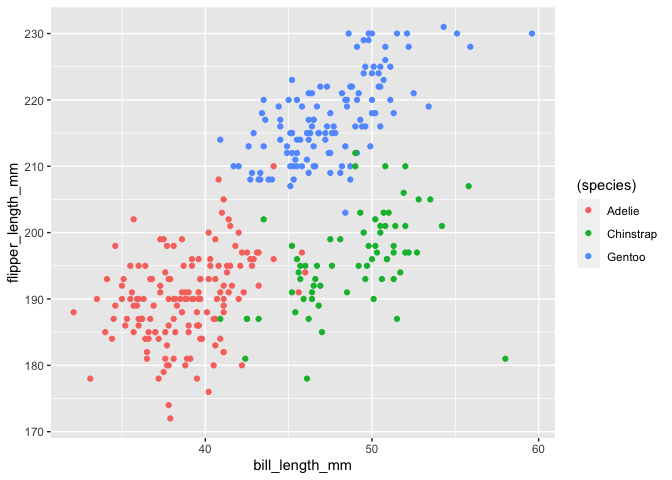

p8105\_hw1\_ym2183
================
Anna Ma
9/26/2021

## Problem 1

### 1.1 Creating the Data frame

``` r
problem1_df <- tibble(
  vec_random = rnorm(10, mean = 0, sd = 1),
  vec_logical = vec_random > 0, 
  vec_char = c("a","b","c","d","e","f","g","h","i","j"),
  vec_factor = factor(c("low","medium","high","medium","high","low","low","medium","high","high"))
)
```

### 1.2 Take mean of each variable

``` r
#1.Random sample of standard normal distribution 
mean(pull(problem1_df,vec_random))
```

    ## [1] 0.1536994

``` r
#2.Logical vector
mean(pull(problem1_df,vec_logical))
```

    ## [1] 0.8

``` r
#3. Character vector
mean(pull(problem1_df,vec_char))
```

    ## Warning in mean.default(pull(problem1_df, vec_char)): argument is not numeric or
    ## logical: returning NA

    ## [1] NA

``` r
#4. Factor Vector 
mean(pull(problem1_df,vec_factor))
```

    ## Warning in mean.default(pull(problem1_df, vec_factor)): argument is not numeric
    ## or logical: returning NA

    ## [1] NA

We can take the mean for the random sample of standard normal
distribution and the logical vector. However, the mean of the character
vector and factor vector cannot be taken.

### 1.3

``` r
#1.Logical vector
as.numeric(pull(problem1_df,vec_logical))
#2. Character vector
as.numeric(pull(problem1_df,vec_char))
#3. Factor Vector 
as.numeric(pull(problem1_df,vec_factor))
```

The logical vector and the factor vector was converted. In the logical
vector, TURE values are converted to 1, and the FALSE values are
converted to zero. In the factor vector, the levels were converted to
numeric value 1 to 3 indicating 3 different levels. The character vector
was not converted to numbers. This explain why the logical vector has a
mean whereas the other vectors does not. The mean of the the logical
vector shows the average of the sample and how likely the sample is
true; the character values do not have intrinsic numeric value and
therefore does not have a mean; finally, the factor vector does not have
a mean even though the levels are numeric because levels are similar to
ranks, whose mean has no numerical meaning.

## Problem 2

### Data description

``` r
data("penguins", package = "palmerpenguins")
penguins
```

    ## # A tibble: 344 × 8
    ##    species island    bill_length_mm bill_depth_mm flipper_length_mm body_mass_g
    ##    <fct>   <fct>              <dbl>         <dbl>             <int>       <int>
    ##  1 Adelie  Torgersen           39.1          18.7               181        3750
    ##  2 Adelie  Torgersen           39.5          17.4               186        3800
    ##  3 Adelie  Torgersen           40.3          18                 195        3250
    ##  4 Adelie  Torgersen           NA            NA                  NA          NA
    ##  5 Adelie  Torgersen           36.7          19.3               193        3450
    ##  6 Adelie  Torgersen           39.3          20.6               190        3650
    ##  7 Adelie  Torgersen           38.9          17.8               181        3625
    ##  8 Adelie  Torgersen           39.2          19.6               195        4675
    ##  9 Adelie  Torgersen           34.1          18.1               193        3475
    ## 10 Adelie  Torgersen           42            20.2               190        4250
    ## # … with 334 more rows, and 2 more variables: sex <fct>, year <int>

The “penguins” dataset contains 8 variables and 344 subjects. The
variables include species, island, bill\_length\_mm, bill\_depth\_mm,
flipper\_length\_mm, body\_mass\_g, sex, year.

``` r
# mean of flipper with the NA values
mean(pull(penguins,flipper_length_mm))     
```

    ## [1] NA

``` r
# mean of flipper after taking out the NAs
mean(pull(penguins,flipper_length_mm),na.rm = TRUE)
```

    ## [1] 200.9152

The mean of flipper length is unknown, NA. This is beacuse there are
unknown values in the variable flipper\_length\_mm

If we take out the unknown values from the flipper\_length\_mm variable,
then the mean of flipper length is 200.9152047.

### Scatter plot

``` r
ggplot(penguins, aes(x = bill_length_mm, y = flipper_length_mm, color  = (species))) + geom_point()
```

    ## Warning: Removed 2 rows containing missing values (geom_point).

<!-- -->

``` r
ggsave("p8105_hw1_problem2_ym2813.pdf")
```

    ## Saving 7 x 5 in image

    ## Warning: Removed 2 rows containing missing values (geom_point).
